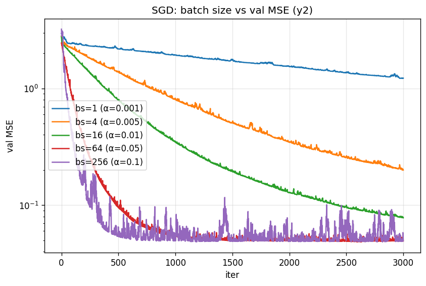
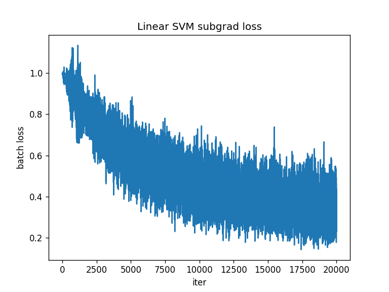

# 作业 1 说明文档

> 软件学院 · 尹泽华 · 2023010372

## 运行环境

Python 3.12 + 见 `requirements.txt`；两份代码分别进目录执行即可：

```bash
pip install -r requirements.txt
cd linear && python start_code.py     # 日志 linear/run_linear.log
cd ../svm && python start_code.py     # 日志 svm/run_svm.log
```

产物：`linear/sgd_batch_size.png`、`svm/svm_linear_loss.png`

---

## 2 线性模型

### 2.1 数据处理（5pt）

#### 2.1.1 `split_data`

按 `split_size` 的累积分位点切分，若 `shuffle=True`，对 $X, y_1, y_2, y_3$ 用同一套 permutation，保证样本—标签一一对齐

#### 2.1.2 `feature_normalization`

只用训练集统计 min/max，对三份数据套同一仿射：

$$
\tilde{x}_j = \frac{x_j - \min_{\text{train}} x_j}{\max_{\text{train}} x_j - \min_{\text{train}} x_j}
$$

常数列分母记为 1，防止除零

### 2.2 基函数与正则化（7pt）

#### 2.2.1 `build_basis_features`

$$
\Phi(x_1, x_2, x_3) = [\, x_1,\ x_2,\ x_3,\ \cos x_1,\ \cos x_2,\ \cos x_3,\ x_1^2,\ x_2^2,\ x_3^2 \,]^\top
$$

#### 2.2.2 L1 / L2 正则化实验

根据 `generate_data.py`，$y_1 = -0.5 - 2x_1 + 0.5 \cos(x_2) + 0.2 x_3^2 + \varepsilon$，故真实相关的三维是 $x_1,\ \cos(x_2),\ x_3^2$。

**L2**：$\lambda$ 越大，9 个权重等比收缩，但相对大小关系维持不变；$\lambda = 5$ 时全部接近 0、模型退化为常数

| $\lambda$ | $x_1$      | $\cos(x_2)$ | $x_3^2$    | 其它 6 维 (max abs) |
| --------- | ---------- | ----------- | ---------- | ------------------- |
| 1e-4      | **-1.995** | **+0.496**  | **+0.198** | $\le 0.009$         |
| 1e-2      | -1.974     | +0.486      | +0.194     | $\le 0.025$         |
| 1         | -0.961     | +0.168      | +0.162     | $\le 0.052$         |
| 5         | -0.313     | +0.049      | +0.110     | $\le 0.032$         |

**L1**：无关的 6 维接近 0；$\lambda = 1$ 时只剩 $x_1, x_3^2$；$\lambda = 5$ 全接近0

| $\lambda$ | $x_1$      | $\cos(x_2)$ | $x_3^2$    | 其它 6 维 (max abs) |
| --------- | ---------- | ----------- | ---------- | ------------------- |
| 1e-4      | **-1.995** | **+0.496**  | **+0.198** | 0.006               |
| 1e-2      | **-1.990** | **+0.487**  | **+0.199** | **2e-4**            |
| 1         | **-1.463** | 3e-4        | **+0.132** | 4e-4                |
| 5         | 1e-4       | 2e-4        | 1e-4       | 2e-4                |

**三个重要自变量**：$x_1,\ \cos(x_2),\ x_3^2$，与生成机制一致

**解释**：L2 的梯度是 $2\lambda \theta$，在每一维上是连续的线性收缩，不会让某一维在有限迭代中达到恰好 0；L1 的次梯度 $\lambda \operatorname{sgn}(\theta)$ 在 $\theta_j = 0$ 处的次微分是整个区间 $[-\lambda, \lambda]$，只要数据项梯度绝对值不超过 $\lambda$，$\theta_j = 0$ 就是 KKT 点。因此 L1 具备稀疏选择能力，L2 只能做各向同性收缩

### 2.3 目标函数与梯度（12pt）

#### 2.3.1 矩阵形式的 $J(\theta)$

$$
J(\theta) = \frac{1}{m}(X\theta - y)^\top (X\theta - y) + \lambda\, \theta^\top \theta
$$

#### 2.3.2 `compute_regularized_square_loss`

`r = X @ theta - y;  return r @ r / m + lam * theta @ theta`。

#### 2.3.3 矩阵形式的梯度推导

记 $r = X\theta - y$。数据项 $\frac{1}{m} r^\top r$ 对 $\theta$ 求导：由链式法则，

$$
\nabla_\theta \left( \frac{1}{m} r^\top r \right) = \frac{1}{m}\cdot 2 r^\top \cdot \frac{\partial r}{\partial \theta} = \frac{2}{m} X^\top r = \frac{2}{m} X^\top (X\theta - y)
$$

正则项 $\lambda \theta^\top \theta$ 对 $\theta$ 求导得 $2\lambda \theta$。两项相加：

$$
\nabla_\theta J(\theta) = \frac{2}{m} X^\top (X\theta - y) + 2\lambda \theta
$$

#### 2.3.4 `compute_regularized_square_loss_gradient`

`return 2/m * X.T @ (X @ theta - y) + 2 * lam * theta`。

`grad_checker` 通过中心差分 $\frac{J(\theta + \varepsilon e_j) - J(\theta - \varepsilon e_j)}{2\varepsilon}$ 逐维近似梯度，在 $\theta = 0$ 与随机 $\theta$ 上都通过了 `tolerance = 1e-4`。

### 2.4 梯度下降（6pt）

#### 2.4.1 一阶近似 + 最速下降方向

对可微 $J$，在 $\theta$ 附近做一阶 Taylor 展开：

$$
J(\theta + \eta h) = J(\theta) + \eta\, \nabla J(\theta)^\top h + o(\eta)
$$

记 $g = \nabla J(\theta)$。在 $\|h\|_2 = 1$ 的约束下最小化 $g^\top h$，由 Cauchy–Schwarz 不等式

$$
g^\top h \ge -\|g\|_2 \cdot \|h\|_2 = -\|g\|_2
$$

等号当且仅当 $h = -g / \|g\|_2$ 取得。这即**负梯度方向是最速下降方向**。取步长 $\alpha > 0$ 得更新式

$$
\theta \leftarrow \theta - \alpha\, \nabla J(\theta)
$$

#### 2.4.2 `grad_descent`

每步调用 2.3.4 的梯度、按上式更新，并用 2.3.2 的损失记录 `loss_hist[i]`，`check_gradient=True` 时每步都先做数值梯度校验。

### 2.5 模型选择（5pt）

拿 `y2` 来调。步长 $\alpha$ 试了 $\{0.01, 0.05, 0.1, 0.2\}$，正则 $\lambda$ 试了 $\{0, 10^{-4}, 10^{-3}, 10^{-2}, 10^{-1}\}$，每组都跑 2000 步 GD，看验证集 MSE：

| $\alpha \backslash \lambda$ | 0      | 1e-4        | 1e-3   | 1e-2   | 1e-1  |
| --------------------------- | ------ | ----------- | ------ | ------ | ----- |
| 0.01                        | 0.1261 | 0.1267      | 0.1325 | 0.2038 | 1.001 |
| 0.05                        | 0.0493 | 0.0494      | 0.0505 | 0.1181 | 0.999 |
| **0.10**                    | 0.0491 | **0.04911** | 0.0501 | 0.1179 | 0.999 |
| 0.20                        | NaN    | NaN         | NaN    | NaN    | NaN   |

最优是 $\alpha = 0.1,\ \lambda = 10^{-4}$，val MSE = 0.04911，放到测试集上 MSE = 0.04201。


### 2.6 随机梯度下降（9pt）

#### 2.6.1 SGD 梯度的矩阵形式

对 batch $B = \{(x_{i_k}, y_{i_k})\}_{k=1}^{n}$，把 2.3.1 的和缩到 batch 上、再对 $\theta$ 求导：

$$
\nabla J_{\mathrm{SGD}}(\theta) = \frac{2}{n} \sum_{k=1}^{n} x_{i_k} (x_{i_k}^\top \theta - y_{i_k}) + 2\lambda \theta = \frac{2}{n} X_B^\top (X_B \theta - y_B) + 2\lambda \theta
$$

#### 2.6.2 `stochastic_grad_descent`

用 `np.random.RandomState(0).randint` 均匀采样 `batch_size` 个下标；按 2.6.1 公式更新。

#### 2.6.3 批大小实验

小 batch 梯度方差大，$\operatorname{Var}(\hat g) \propto 1/n$，要稳定收敛必须同时调小步长。以下是为每个 $n$ 选的步长和跑 3000 步后的 val MSE：

| batch size | $\alpha$ | val MSE @ 3000 step |
| ---------- | -------- | ------------------- |
| 1          | 0.001    | 1.226               |
| 4          | 0.005    | 0.200               |
| 16         | 0.01     | 0.0778              |
| 64         | 0.05     | **0.0492**          |
| 256        | 0.1      | **0.0496**          |

曲线见 `linear/sgd_batch_size.png`（对数纵轴）

观察：

- `bs=1` 噪声极大，只能用 $\alpha = 10^{-3}$，3000 步远未接近 0.05；
- `bs` 增大到 64 就已经接近 2.5 的全批 GD 最优（0.0491）；
- `bs=256` 时 batch 梯度已非常接近真实梯度，用 $\alpha = 0.1$ 也稳定


### 2.7 Softmax 回归（5pt）

助教提供的 `softmax_util.py` 用 PyTorch 实现 `nn.Linear(d, K, bias=False)` + `CrossEntropyLoss` + Adam，带按 `val_loss` early stop 的模型选择。

实测（36 维 × 4 类 × 1000 epoch）：

- best_epoch = 166，best_val_loss = 1.1923，val_acc ≈ 0.505；
- 测试集：loss = 1.2806，**acc = 0.39**。

这个低准确率不是模型/优化问题，而是数据生成机制本身的上界限制，详见 2.9。

### 2.8 Poisson 回归（6pt）

Poisson 分布 $P(y; \lambda) = \frac{\lambda^y e^{-\lambda}}{y!}$，GLM link $\lambda = \exp(w^\top x)$。先把它写成指数族：

$$
P(y; \theta, \phi) = \exp\!\left( \frac{y\theta - b(\theta)}{\phi} + c(y, \phi) \right)
$$

对 Poisson 有 $\theta = \log \lambda = w^\top x$，$b(\theta) = e^\theta = \lambda$，$\phi = 1$，$c(y, \phi) = -\log(y!)$。

#### 2.8.1 负对数似然损失

单样本：

$$
-\log P(y; w, x) = -\frac{y\theta - b(\theta)}{\phi} - c(y, \phi) = -y\, w^\top x + \exp(w^\top x) + \log(y!)
$$

对 $m$ 条训练数据求和：

$$
\mathcal{L}(w) = \sum_{i=1}^{m} \left[ \exp(w^\top x_i) - y_i\, w^\top x_i + \log(y_i!) \right]
$$

#### 2.8.2 最终优化目标

$\log(y_i!)$ 与 $w$ 无关，从优化角度可直接去掉：

$$
\min_{w}\ \sum_{i=1}^{m} \left[ \exp(w^\top x_i) - y_i\, w^\top x_i \right]
$$

这是关于 $w$ 的凸函数（Hessian $= \sum_i \exp(w^\top x_i)\, x_i x_i^\top \succeq 0$），可用梯度类方法求解。

### 2.9 扩展：数据生成与实验现象分析（10pt）

选话题 2、3、4 ，实验脚本在 `experiments/` 下（`topic2.py / topic3_knn.py / topic4_bayes.py`）。

#### 话题 2：9 个基函数都与 $y_1$ 有关时，正则化是否能学回真实系数

助教在 2.2.2 只让 $(x_1, \cos x_2, x_3^2)$ 与 $y_1$ 有关，所以 L1 能把无关的 6 维压到 0。自己构造了一个 9 项全部非零的 $y_1$：

$$
y_1 = 0.8\, x_1 - 0.6\, x_2 + 0.7\, x_3 + 0.5 \cos x_1 - 0.4 \cos x_2 + 0.3 \cos x_3 + 0.2\, x_1^2 - 0.15\, x_2^2 + 0.25\, x_3^2 + 0.5 + \varepsilon
$$

然后按 2.2 的套路做 [0,1] 归一化、跑 L1/L2。挑几个有代表性的结果：

| reg          | $\lambda$ | val MSE | $x_1$ | $\cos x_1$ | $x_1^2$ | $\cos x_2$ | $x_3^2$ |
| ------------ | --------- | ------- | ----- | ---------- | ------- | ---------- | ------- |
| 真实（同向） | —         | —       | +     | +          | +       | −          | +       |
| L2           | 1e-4      | 0.27    | +4.75 | **+0.57**  | +1.93   | −0.49      | +1.64   |
| L2           | 1e-2      | 0.45    | +3.53 | **−0.03**  | +0.28   | −0.42      | +1.04   |
| L2           | 1         | 7.06    | +0.09 | +0.0002    | +0.001  | +0.07      | +0.11   |
| L1           | 1e-4      | 0.20    | +4.85 | **+1.03**  | +2.97   | −0.56      | +1.82   |
| L1           | 1e-2      | 0.26    | +4.92 | **≈0**     | +0.30   | −0.41      | +1.52   |
| L1           | 1         | 7.86    | ≈0    | ≈0         | ≈0      | ≈0         | ≈0      |

观察：

1. **$\lambda$ 很小时 val MSE 最低**（L1 λ=1e-4 时 0.20），但此时学到的 $\cos x_1$ 系数约 **+1.03**，是真实值 +0.5 的两倍多，$x_1^2$ 学到 +2.97 同样远超真实 +0.2
2. **$\lambda$ 变大**（λ=1e-2），$\cos x_1$ 从 +0.57/+1.03 直接跳到接近 0 甚至 −0.03 变号
3. **$\lambda$ 再大**（λ=1），两种正则都把所有系数变成接近 0，模型退化为只拟合 bias，val MSE 涨到 7

**可能的解释：** $x_1 \in [-3, 3]$ 时 $x_1,\ x_1^2,\ \cos x_1$ 在归一化后高度相关（$x_1^2$ 对 $x_1$ 的 $R^2 \approx 0.5$，$\cos x_1$ 对 $x_1^2$ 也有明显关系）多重共线性下，最小二乘解不唯一，真实系数和其他组合在训练集上几乎等价，正则化只是在众多等效解里选范数最小的，不保证是真实的那个。正则化能改善预测误差，但不保证恢复模型结构

#### 话题 3：数据量对 KNN 的影响

用 `sklearn.neighbors` 调包，特征按训练集 min/max 归一化。本小题主要关注训练样本数 $n$ 对 KNN 效果的影响，因此先用全量数据跑 $K$ 与距离度量的对比，再固定相对较好的设置，逐步缩减 $n$ 来观察变化。

作为参照，全量 1000 条训练数据下 $y_2$ 回归与 $y_3$ 分类的结果：

| metric (y2) | k=1  | k=3  | k=5  | k=10     | k=30 | k=100 |
| ----------- | ---- | ---- | ---- | -------- | ---- | ----- |
| euclidean   | 1.67 | 1.01 | 0.93 | 0.87     | 1.03 | 1.19  |
| cosine      | 1.71 | 0.88 | 0.81 | **0.80** | 0.98 | 1.17  |

| metric (y3) | k=1  | k=3  | k=5  | k=10 | k=30 | k=100    |
| ----------- | ---- | ---- | ---- | ---- | ---- | -------- |
| euclidean   | 0.30 | 0.26 | 0.29 | 0.33 | 0.29 | **0.38** |
| cosine      | 0.32 | 0.30 | 0.34 | 0.33 | 0.31 | **0.38** |

$y_2$ 上 cosine + $k=10$ 最好（0.80），$y_3$ 上各度量差距不大、最好 0.38

**$y_2$ 随 $n$ 变化（cosine）**：

| $n$ \ $k$ | k=1   | k=5   | k=10  | k=30  |
| --------- | ----- | ----- | ----- | ----- |
| 50        | 2.388 | 1.334 | 1.391 | 1.924 |
| 100       | 2.113 | 1.110 | 1.043 | 1.436 |
| 300       | 1.890 | 1.060 | 1.061 | 1.201 |
| 500       | 1.890 | 0.987 | 0.897 | 1.108 |
| 800       | 1.819 | 0.873 | 0.881 | 1.028 |
| 1000      | 1.707 | 0.807 | 0.803 | 0.979 |

**$y_3$ 随 $n$ 变化**（$k=10$, euclidean）：$n=50 \to 0.32$、$n=100 \to 0.36$、$n=300 \to 0.34$、$n=500 \to 0.35$、$n=800 \to 0.35$、$n=1000 \to 0.33$。

从这两组数据可以得到以下几点结论：

1. **数据量越大，KNN 在回归任务上越精细**。这符合 KNN 作为非参数估计的理论性质：预测值是局部邻域的平均，$n$ 越大则每个查询点的 $k$ 个近邻在特征空间上越接近它本身，偏差越小。

2. **最优 $k$ 随 $n$ 增大而增大**。原因在于 $k$ 控制的是"偏差—方差"的折中：训练样本少时，只能取较小的 $k$ 保证邻居真的"邻近"（降偏差），但代价是方差大；数据变多后，稍大的 $k$ 才能在不引入过多偏差的前提下充分平滑掉噪声。


3. **$y_3$ 上增加数据量几乎没有改善**，6 个 $n$ 值对应的准确率在 0.32~0.36 之间来回抖动，没有明显趋势。这不是 KNN 本身的问题，而是话题 4 推出的贝叶斯错误率上界 0.486 已经锁死了所有模型的表现：$n=1000$ 时模型已经接近这个天花板，再增加数据也只能逼近 0.486

#### 话题 4：Softmax 准确率 0.39 ，数据本身有贝叶斯错误率

2.7 测出来 test acc = 0.39，根据 `generate_data.py` 的 y3 流程：每类先算线性得分 $s_c$，加 `noise_std=0.1` 的高斯噪声，减一个固定偏移 $[0.864, 10.548, -0.463, 0.729]$，再过一个 `temperature=2` 的 softmax 得到概率，按概率抽样而不是取 argmax：

$$
p_c(x) = \frac{\exp(s_c(x) / 2)}{\sum_{c'} \exp(s_{c'}(x) / 2)}, \qquad y \sim \operatorname{Cat}(p(x))
$$

关键在于**标签本身就是随机的**，最优的贝叶斯分类器只能预测 $\hat y = \arg\max_c p_c(x)$，它期望的准确率上界是

$$
\operatorname{Acc}^* = \mathbb{E}_x \!\left[\, \max_c p_c(x) \,\right]
$$

 `topic4_bayes.py`，按 `generate_data.py` 原样重放 100k 个样本，直接算这个期望：

```
类别边缘分布:  [0.2450  0.2591  0.2575  0.2384]
Bayes optimal accuracy (argmax): 0.4860
Bayes error rate: 0.5140
```

所以 **0.486 是上界**。实测测试集 acc = 0.39，应该是 100 条测试样本的抽样波动 + 模型对 p(x) 的估计误差，合理。话题 3 里 KNN 在 y3 上也达不到 0.39 以上。

---

## 3 支持向量机

### 3.1 合页损失的次梯度（3pt）

$J(w) = \max\{0,\ 1 - y w^\top x\}$，对 $w$ 求次梯度，分三种情形：

- $y w^\top x < 1$：$J$ 局部等于光滑函数 $1 - y w^\top x$，梯度唯一为 $-y x$；
- $y w^\top x > 1$：$J \equiv 0$，梯度唯一为 $0$；
- $y w^\top x = 1$：是非光滑点，次微分为上面两个梯度的凸包 $\partial J(w) = \{-t y x : t \in [0, 1]\}$，取任一皆可（通常取 0 或 $-yx$）。

常用写法：

$$
\partial J(w) = -y x \cdot \mathbb{1}[y w^\top x < 1]
$$

### 3.2 硬间隔 SVM（6pt）

#### 3.2.1 KKT 条件

原问题：$\min_{w,b} \frac{1}{2}\|w\|^2$，s.t. $y_i(w^\top x_i + b) \ge 1,\ \forall i$。

引入乘子 $\mu_i \ge 0$，拉格朗日函数：

$$
L(w, b, \mu) = \frac{1}{2}\|w\|^2 - \sum_{i=1}^{m} \mu_i \left[ y_i(w^\top x_i + b) - 1 \right]
$$

KKT 条件：

1. **原始**：$y_i(w^\top x_i + b) \ge 1,\ \forall i$；
2. **对偶**：$\mu_i \ge 0,\ \forall i$；
3. **互补松弛**：$\mu_i \left[ y_i(w^\top x_i + b) - 1 \right] = 0,\ \forall i$。

#### 3.2.2 $w$ 是训练样本的线性组合；支持向量位于间隔平面

由稳定性条件 $w = \sum_i \mu_i y_i x_i$，令 $\alpha_i = \mu_i y_i$，得

$$
w = \sum_{i=1}^{m} \alpha_i x_i
$$

即 $w$ 是训练样本 $\{x_i\}$ 的线性组合。

若 $\alpha_i \ne 0$，则 $\mu_i \ne 0$。由互补松弛必有

$$
y_i(w^\top x_i + b) - 1 = 0 \quad\Longrightarrow\quad y_i(w^\top x_i + b) = 1
$$

即 $x_i$ 恰好在间隔超平面 $w^\top x + b = \pm 1$ 上。这些 $\alpha_i \ne 0$ 的样本即**支持向量**

### 3.3 软间隔 SVM（9pt）

原问题（引入松弛变量 $\xi_i \ge 0$）：

$$
\min_{w, b, \xi}\ \frac{\lambda}{2}\|w\|^2 + \frac{1}{m} \sum_{i=1}^{m} \xi_i^p,\quad \text{s.t. } y_i(w^\top x_i + b) \ge 1 - \xi_i,\ \xi_i \ge 0
$$

#### 3.3.1 一般 $p \ge 1$ 的拉格朗日

引入乘子 $\mu_i \ge 0$ 对应间隔约束、$\beta_i \ge 0$ 对应非负约束：

$$
L(w, b, \xi, \mu, \beta) = \frac{\lambda}{2}\|w\|^2 + \frac{1}{m}\sum_i \xi_i^p - \sum_i \mu_i \left[ y_i(w^\top x_i + b) - 1 + \xi_i \right] - \sum_i \beta_i \xi_i
$$

#### 3.3.2 $p = 1$ 的对偶形式

对原始变量取偏导置零：

$$
\nabla_w L = \lambda w - \sum_i \mu_i y_i x_i = 0 \quad\Longrightarrow\quad w = \frac{1}{\lambda}\sum_i \mu_i y_i x_i \tag{i}
$$

$$
\nabla_b L = -\sum_i \mu_i y_i = 0 \quad\Longrightarrow\quad \sum_i \mu_i y_i = 0 \tag{ii}
$$

$$
\partial_{\xi_i} L = \frac{1}{m} - \mu_i - \beta_i = 0 \quad\Longrightarrow\quad \beta_i = \frac{1}{m} - \mu_i \ge 0 \tag{iii}
$$

由 (iii) 及 $\mu_i, \beta_i \ge 0$ 推出 $0 \le \mu_i \le \frac{1}{m}$。

把 (i)(ii)(iii) 代回 $L$：

- $\frac{\lambda}{2}\|w\|^2 = \frac{\lambda}{2} \cdot \frac{1}{\lambda^2} \sum_{i,j} \mu_i \mu_j y_i y_j x_i^\top x_j = \frac{1}{2\lambda} \sum_{i,j} \mu_i \mu_j y_i y_j x_i^\top x_j$
- $-\sum_i \mu_i y_i w^\top x_i = -\frac{1}{\lambda} \sum_{i,j} \mu_i \mu_j y_i y_j x_i^\top x_j$
- $-\sum_i \mu_i y_i b = 0$（由 (ii)）
- $\frac{1}{m}\sum_i \xi_i - \sum_i \mu_i \xi_i - \sum_i \beta_i \xi_i = \sum_i \xi_i (\frac{1}{m} - \mu_i - \beta_i) = 0$（由 (iii)）
- 常数项 $+\sum_i \mu_i$

合并得对偶目标：

$$
g(\mu) = \sum_i \mu_i - \frac{1}{2\lambda} \sum_{i,j} \mu_i \mu_j y_i y_j x_i^\top x_j
$$

对偶问题：

$$
\max_{\mu}\ \sum_{i=1}^{m} \mu_i - \frac{1}{2\lambda} \sum_{i,j=1}^{m} \mu_i \mu_j y_i y_j x_i^\top x_j,\quad \text{s.t. } 0 \le \mu_i \le \frac{1}{m},\ \sum_{i=1}^{m} \mu_i y_i = 0
$$

#### 3.3.3 次梯度推导

把每个样本单独的目标 $J_i$ 写作

$$
J_i(w, b) = \frac{\lambda}{2}\|w\|^2 + \max\{0,\ 1 - y_i(w^\top x_i + b)\}
$$

- $\frac{\lambda}{2}\|w\|^2$ 对 $w$ 梯度为 $\lambda w$、对 $b$ 梯度为 $0$；
- hinge 项 $\max\{0,\ 1 - y_i(w^\top x_i + b)\}$ 的次梯度已由 3.1 给出：$y_i(w^\top x_i + b) < 1$ 时对 $w$ 为 $-y_i x_i$、对 $b$ 为 $-y_i$；否则均为 $0$。

两部分相加得到

$$
\partial_w J_i = \begin{cases} \lambda w - y_i x_i, & y_i(w^\top x_i + b) < 1 \\ \lambda w, & y_i(w^\top x_i + b) \ge 1 \end{cases}
$$

$$
\partial_b J_i = \begin{cases} -y_i, & y_i(w^\top x_i + b) < 1 \\ 0, & y_i(w^\top x_i + b) \ge 1 \end{cases}
$$

这正是题目所给形式

### 3.4 核方法（9pt）

#### 3.4.1 $k(x, x') = \cos\angle(x, x')$ 是核函数

做归一化映射 $\Phi(x) = x / \|x\|$（$x \ne 0$），则

$$
\Phi(x)^\top \Phi(x') = \frac{x^\top x'}{\|x\|\, \|x'\|} = \cos\angle(x, x') = k(x, x')
$$

所以 $k$ 由显式特征映射 $\Phi$ 给出，自然是核函数。

核矩阵半正定性的独立验证：对任意 $a \in \mathbb{R}^m$，

$$
a^\top K a = \sum_{i, j} a_i a_j \Phi(x_i)^\top \Phi(x_j) = \left\| \sum_i a_i \Phi(x_i) \right\|^2 \ge 0
$$

对称性由 $\Phi(x)^\top \Phi(x') = \Phi(x')^\top \Phi(x)$ 显然。

#### 3.4.2 核的和与积仍是核

设已知两个核 $k_1, k_2$，及其 Mercer 映射 $\Phi_1: \mathcal{X} \to \mathbb{R}^{d_1}$、$\Phi_2: \mathcal{X} \to \mathbb{R}^{d_2}$，使 $k_1(x, x') = \Phi_1(x)^\top \Phi_1(x')$、$k_2(x, x') = \Phi_2(x)^\top \Phi_2(x')$。

**（a）和 $k_s(x, x') = k_1(x, x') + k_2(x, x')$ 是核**。

构造拼接特征 $\Phi_s(x) = [\Phi_1(x);\ \Phi_2(x)] \in \mathbb{R}^{d_1 + d_2}$，则

$$
\Phi_s(x)^\top \Phi_s(x') = \Phi_1(x)^\top \Phi_1(x') + \Phi_2(x)^\top \Phi_2(x') = k_1(x, x') + k_2(x, x') = k_s(x, x')
$$

矩阵视角同样成立：若 $K_1 = M_1 M_1^\top,\ K_2 = M_2 M_2^\top$，则 $K_s = K_1 + K_2 = [M_1\ M_2][M_1\ M_2]^\top \succeq 0$。

**（b）积 $k_p(x, x') = k_1(x, x') \cdot k_2(x, x')$ 是核**。

构造张量积特征 $\Phi_p(x) = \Phi_1(x) \otimes \Phi_2(x) \in \mathbb{R}^{d_1 d_2}$（即 $\Phi_p(x)_{(a, b)} = \Phi_1(x)_a \cdot \Phi_2(x)_b$），则

$$
\Phi_p(x)^\top \Phi_p(x') = \sum_{a, b} \Phi_1(x)_a \Phi_2(x)_b \Phi_1(x')_a \Phi_2(x')_b = \left( \sum_a \Phi_1(x)_a \Phi_1(x')_a \right) \left( \sum_b \Phi_2(x)_b \Phi_2(x')_b \right) = k_1 \cdot k_2
$$

矩阵视角（Schur product theorem）：两个半正定矩阵的 Hadamard 积仍半正定。对任意 $a$，令 $u_i = \Phi_1(x_i) \otimes \Phi_2(x_i)$，则

$$
a^\top K_p a = \sum_{i, j} a_i a_j\, u_i^\top u_j = \left\| \sum_i a_i u_i \right\|^2 \ge 0
$$


#### 3.4.3 带核的软间隔对偶与预测

直接在 3.3.2 的对偶中把内积 $x_i^\top x_j$ 替换为 $k(x_i, x_j)$：

$$
\max_{\mu}\ \sum_i \mu_i - \frac{1}{2\lambda} \sum_{i, j} \mu_i \mu_j y_i y_j\, k(x_i, x_j),\quad \text{s.t. } 0 \le \mu_i \le \frac{1}{m},\ \sum_i \mu_i y_i = 0
$$

由 $w = \frac{1}{\lambda}\sum_i \mu_i y_i\, \Phi(x_i)$，对新样本 $x$，

$$
w^\top \Phi(x) + b = \frac{1}{\lambda}\sum_i \mu_i y_i\, k(x_i, x) + b
$$

$$
f(x) = \operatorname{sign}\!\left( \frac{1}{\lambda}\sum_i \mu_i y_i\, k(x_i, x) + b \right)
$$

偏置 $b$ 可用任意满足 $0 < \mu_i < 1/m$ 的支持向量 $x_i$（这类 $\xi_i = 0$，$y_i f(x_i) = 1$）反解。

### 3.5 情绪检测（13pt）

数据：`data_train.csv` 过滤 joy/sadness 后剩 3260 条训练、`data_val.csv` 剩 1383 条验证。文本直接用 sklearn 的 `TfidfVectorizer` 向量化（去英文停用词），再手动拼一列全 1 当偏置。最后向量维度 5000 出头。

#### 3.5.1 线性 SVM

按 3.3.3 推的次梯度写，每步随机抽 batch：

$$
\hat g = \lambda w - \frac{1}{|B|} \sum_{i \in B,\ y_i w^\top x_i < 1} y_i x_i,\qquad w \leftarrow w - \alpha\, \hat g
$$

超参随便调了几组，最后用 $\alpha = 0.05$、$\lambda = 10^{-4}$、`num_iter = 20000`、`batch = 32`。损失曲线在 `svm/svm_linear_loss.png`，大约 5000 步以后比较平稳


验证集结果：

- val_acc = **0.8539**，F1 = **0.8583**
- 混淆矩阵（行真实、列预测，+1 = joy，-1 = sadness）：

|         | pred +1 | pred -1 |
| ------- | ------- | ------- |
| true +1 | 612     | 95      |
| true -1 | 107     | 569     |

两类错得比较对称，既没有偏向预测 joy 也没有偏向 sadness。

#### 3.5.2 Kernel SVM

核方法直接在对偶坐标 $\theta \in \mathbb{R}^m$ 下跑（$w = \sum_j \theta_j \Phi(x_j)$）。一开始写的版本是直接稠密更新 $\theta \leftarrow \theta - \alpha(\lambda K\theta - \dots)$，但每步都要 $O(m^2)$ 的矩阵乘，3260 条样本跑 4000 步要 10 分钟以上。

后借鉴 Pegasos 这个算法，它的更新可以拆成两部分：

- 正则项对应 $\theta$ 的整体收缩：$\theta \leftarrow (1 - \eta_t \lambda) \theta$；
- hinge 项对应只改 batch 内违反 margin 的那几个坐标：$\theta_i \mathrel{+}= \frac{\eta_t}{|B|} y_i$。

步长用 Pegasos 推荐的 $\eta_t = 1/(\lambda t)$。这样每步只有 $O(|B| \cdot m)$ 算 batch 上的 $K[B] \theta$，4000 步大概半秒跑完，比原来版本快了差不多一个数量级。

预测就是 $f(x) = \operatorname{sign} \sum_j \theta_j\, k(x_j, x)$。

试了 6 组超参，对比一下线性核和 RBF 核：

| kernel                 | $\lambda$ | val_acc    | F1         |
| ---------------------- | --------- | ---------- | ---------- |
| linear                 | 1e-4      | 0.8568     | 0.8685     |
| linear                 | 1e-3      | 0.8547     | 0.8664     |
| rbf ($\gamma$=0.001)   | 1e-4      | 0.4888     | 0.0000     |
| rbf ($\gamma$=0.01)    | 1e-4      | 0.7158     | 0.7783     |
| rbf ($\gamma$=0.05)    | 1e-4      | 0.8214     | 0.8063     |
| **rbf ($\gamma$=0.1)** | **1e-4**  | **0.8626** | **0.8675** |

#### 核函数的作用？

以为 RBF 核会有明显提升，结果最好的 RBF（$\gamma = 0.1$）也就比线性核（0.8568）高 0.6 ，而且对 $\gamma$ 特别敏感：

- $\gamma$ 太小（0.001）：$k(x, x') \to 1$，核矩阵接近全 1 阵，模型退化成常数预测，F1 直接 0；
- $\gamma$ 太大（0.5 以上）：$k(x, x') \to \delta_{xx'}$，核矩阵接近单位阵，训练集完美拟合；
- 只有在 $\gamma \approx 0.05 \sim 0.1$ 这一段区间才 work。

理解是：TF-IDF 特征本身就 5000 维、极度稀疏，高维空间里样本两两之间几乎都是"远距离"，RBF 的 $\exp(-\gamma \|x - x'\|^2)$ 要么把所有距离都变成 0、要么都变成 1，很难拉开区分度。线性核反而刚刚好，因为在这么高的维度里文本本身就接近线性可分。如果换成低维稠密的 embedding（比如把每条文本用 Word2Vec 平均成 300 维），可能核方法的优势才会显现。

#### 3.5.3 最终模型

 val_acc 最高的：Kernel SVM，RBF 核，$\gamma = 0.1$，$\lambda = 10^{-4}$。

- val_acc = **0.8626**，F1 = **0.8675**；
- 混淆矩阵：

|         | pred +1 | pred -1 |
| ------- | ------- | ------- |
| true +1 | 622     | 85      |
| true -1 | 105     | 571     |


---

## 声明

- 本次作业未与任何同学交流讨论。
- 本次作业使用了大模型（Claude）辅助调试 `kernel_svm_subgrad_descent` 的数值不稳定问题，据此学习并采用了 Pegasos-kernel 稀疏更新；少量数据分析和格式排版亦由大模型辅助。所有公式推导、代码逻辑、实验结果均由本人独立完成并在本地验证。
